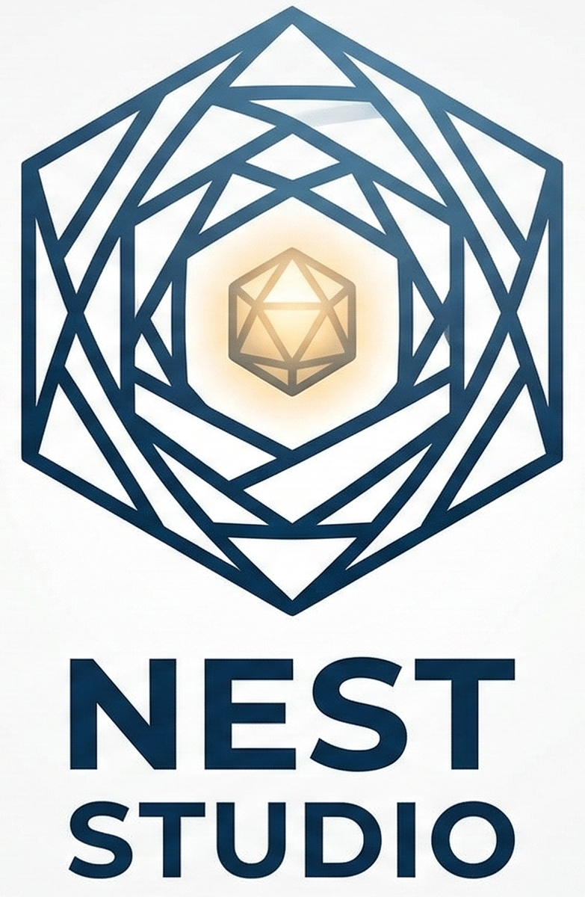
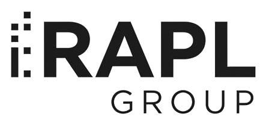

<p align="center">
  
</p>

<h3 align="center">Expertní systém nové generace pro tvorbu a vyhodnocování znalostních bází</h3>

<p align="center">
  
  
  
  
</p>

---

## Co je NEST Studio?

**NEST Studio** je moderní desktopová aplikace pro tvorbu, editaci a vyhodnocování znalostních bází (Knowledge Bases) založených na pravidlových expertních systémech. Navazuje na původní systém NEST vyvinutý na Ostravské univerzitě a přináší nový, intuitivní design a rozšířené možnosti.

Aplikace umožňuje:

- **Vytvářet znalostní báze** s atributy, výroky a pravidly v XML formátu
- **Spouštět inference** (konzultace) nad znalostní bází s různými typy neurčitosti
- **Vizualizovat pravidla** formou stromu a grafu závislostí
- **Exportovat výsledky** do XML

## Screenshoty

> *Screenshoty budou doplněny.*

## Funkce

### Editor znalostní báze
- Typy atributů: **Binární**, **Jednoduchý** (vylučující), **Množinový**, **Numerický**
- Komentáře u atributů i výroků pro lepší přehlednost
- Typy pravidel: **Apriorní** (platí vždy), **Logické** (pravda/nepravda), **Kompozicionální** (váhy -1 až 1)
- Podmínky s konjunkcemi (AND), disjunkcemi (OR) a negacemi
- Textové shrnutí pravidel (`IF sympaticka AND bohatstvi[velke] THEN dobra_manzelka@0.600`)
- Podpora záporných vah závěrů

### Konzultace (inference)
- Režim zobrazení: všechny otázky najednou nebo po jedné
- 6 typů neurčitosti: Standardní, Logický, Neuronový, Hybridní, Gödel, Součinová
- Chytrá relevance otázek – automaticky skrývá irelevantní otázky na základě odpovědí a AND logiky pravidel
- Zobrazení komentářů atributů a výroků v dotazníku
- Export odpovědí a výsledků do XML
- Podpora konfigurovatelného rozsahu vah (`weight_range`)

### Vizualizace
- **Strom pravidel** – hierarchické zobrazení cílů → pravidel → literálů
- **Graf závislostí** – vrstvený graf s barevně odlišenými uzly (otázky, mezivýstupy, cíle)
- Klikatelné uzly pro přímou navigaci do editoru

### Další
- Kontrola aktualizací z GitHub Releases
- Portable single-file `.exe` distribuce
- Čtení Markdown v changelogu

## Struktura projektu

```
NESTv2/
├── src/
│   ├── NestCore/          # Jádro – modely, inference engine, typy neurčitosti
│   ├── NestFormat/        # Čtení a zápis XML formátu znalostních bází
│   └── NestStudio/        # GUI aplikace (Avalonia UI)
├── img/                   # Loga a grafika
├── old/                   # Archiv starého systému NEST (VB.NET)
├── CHANGELOG.md
├── LICENSE.md
└── NESTStudio.slnx        # Solution soubor
```

### Projekty

| Projekt | Popis |
|---------|-------|
| **NestCore** | Doménový model (atributy, pravidla, výroky), inference engine, typy neurčitosti (Standard, Logický, …), analyzátor otázek |
| **NestFormat** | XML reader/writer pro znalostní báze, odpovědi a výsledky |
| **NestStudio** | Avalonia UI aplikace – editor KB, konzultace, vizualizace, aktualizace |

## Požadavky

- [.NET 8.0 SDK](https://dotnet.microsoft.com/download/dotnet/8.0) nebo novější
- Windows / macOS / Linux

## Sestavení a spuštění

```bash
# Klonování repozitáře
git clone https://github.com/playtoncz/NESTv2.git
cd NESTv2

# Sestavení
dotnet build

# Spuštění
dotnet run --project src/NestStudio
```

### Portable build (single-file .exe)

```bash
dotnet publish src/NestStudio/NestStudio.csproj -c Release -r win-x64 --self-contained -p:PublishSingleFile=true -p:IncludeNativeLibrariesForSelfExtract=true -o publish
```

Výsledný spustitelný soubor bude v adresáři `publish/`.

## Formát znalostní báze (XML)

Znalostní báze je uložena v XML formátu s následující strukturou:

```xml
<base>
  <global>
    <description>Název projektu</description>
    <weight_range>3</weight_range>
    <inference_mechanism>standard</inference_mechanism>
    <!-- ... -->
  </global>
  <attributes>
    <attribute>
      <id>bledost</id>
      <name>pacient je bledy</name>
      <type>binary</type>
      <comment>Má pacient bledou pleť?</comment>
    </attribute>
    <!-- ... -->
  </attributes>
  <compositional_rules>
    <rule>
      <id>rule1</id>
      <condition>
        <conjunction>
          <literal><attribute_id>bledost</attribute_id></literal>
          <literal><attribute_id>dychavicnost</attribute_id></literal>
        </conjunction>
      </condition>
      <conclusions>
        <conclusion>
          <attribute_id>diagnoza</attribute_id>
          <proposition_id>TBC</proposition_id>
          <weight>0.600</weight>
        </conclusion>
      </conclusions>
    </rule>
  </compositional_rules>
</base>
```

## Licence

Tento projekt je licencován pod vlastní licencí **NEST Studio License** – viz [LICENSE.md](LICENSE.md).

Vyžaduje viditelné zobrazení loga nebo textu "Powered by RAPL Group" v hlavním rozhraní.

## Autoři

<p align="center">
  <a href="https://rapl-group.eu">
    
  </a>
  &nbsp;&nbsp;&nbsp;&nbsp;
  <a href="https://opf.slu.cz">
    
  </a>
</p>

<p align="center">
  <strong>RAPL Group</strong> &bull; Slezská univerzita v Opavě, OPF Karviná
</p>

## Kontakt

- Web: [rapl-group.eu](https://rapl-group.eu)
- E-mail: [info@rapl-group.eu](mailto:info@rapl-group.eu)
